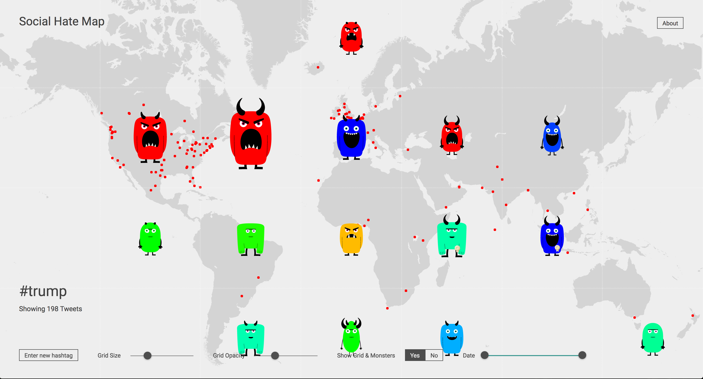
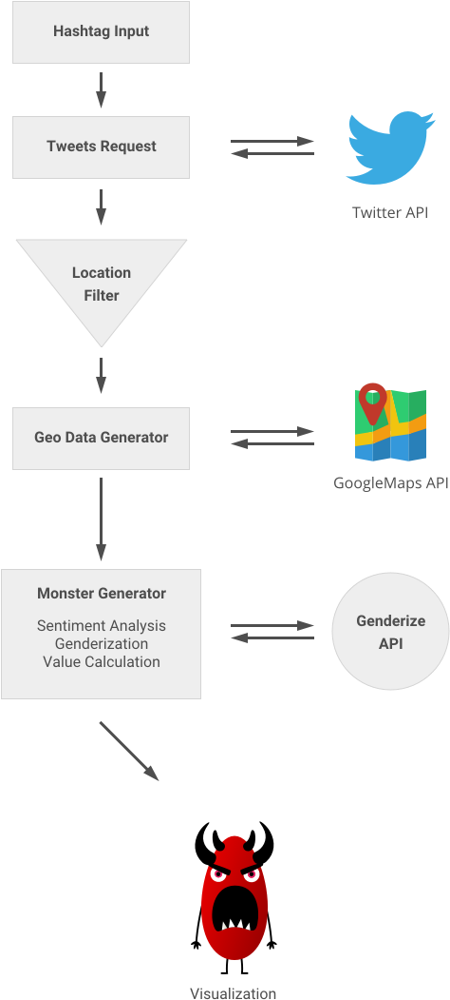
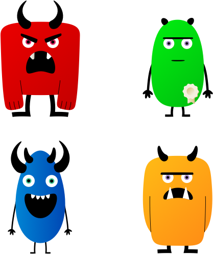

# Social Hatemap

The Social Hate Map visualizes properties of social media messages and users. The data is pulled over APIs, evaluated and then mapped on a global map.

Key visualization elements are small monsters, their respective colors and shapes representing different properties of the tweets. Special focus is set on the sentiment of the messages (sentiment analysis) which is displayed in the overall angrieness level of the monsters, in a way that sentiments regarding a topic can quickly be seized. 

## Process

The user enters a keyword, for example 'Trump'. A request is sent to the Twitter API, fetching Tweets that are hashtagged with this keyword. The returning sample is filtered for location data. Only those who can be located to a specific city or area are processed further. 

To convert the location tag (like 'New York') into geo data, the sample is sent to the Google API and equiped with longitudonal and latidunal information, which is then maped according by a 'mercator transformation'.

In order to visualize the properties, the Tweets are then processed in several ways: 

1. The Tweet's respective sentiment is evaluated by a sentiment analysis algorithm. 
2. The gender of the author is calculated based on their username with aid of an external API, in case this information is not included in the Tweet's info.
3. Further information such as the author's account's age, the number of favourites (=likes) and the share percentage of followers towards the complete amount of all followers is calculated. 

Once the set of property information is complete, the monsters are rendered.

## Monster properties

The visual appearance of the monsters reflects the properties of the incoporated Tweet(s) and its author(s). 

### Sentiment
Sentiment is shown mainly in the color of the monster, ranging from red (negative) over orange, yellow, green (mixed) and cyan to blue (positive). It also affects eyes and mouth of the monster. Depending on the sentiment value, a certain set of eyes and mouth is loaded.

### Amplitude
The Amplitude (meaning: intensity) of a Tweet is displayed in the mouth variation. A more open version of the respective mouth is loaded, if the Tweet has a high amplitude, also depending on sentiment. 

### Favourites
If the Tweet excels a certain number of favourites (or likes), the monster is marked with a badge.   

### Gender
The gender of an author (or the average gender value of a group of authors) is visualized with the monster's body shape. Male authors are shown in a more rectangular body, while female authors have a rounder shape. Since it's 2017, of course there are more than two possible genders.     

### Account age
Depending of the age of the author's account, a certain set of horns is attached to the monster. The older the account, the longer the horns. An account younger than two years shows no horns, while an account older than 8 years shows two pairs.    

## Map & Interface

The map is modeled according to the mercator transformation, resulting in the specific shape of the continents. The map's area is devided by a grid. Tweets within one sector are summed up and their properties are merged. Therefore a monster within a grid area represents a number of Tweets and not individual ones.

If the user clicks on a grid sector, an overlay opens and exact property values are explained. An additional list visualizes the single tweets that are incorporated in this grid sector. 

The user can modify the grid's size and opacity to enlage or reduce the areas and therefore reduce the number of tweets that are merged, in order to get a more specific image. 

It's also possible to remove the grid completely to make single tweets available and access them directly.

Eventually the user can modify a timeframe for the collected tweets in order to visualize a development over time. 

## Team

- [Simon vom Eyser](http://simonvomeyser.de/)
- [Mark Kloubert](http://marckloubert.com)
- Felix Jordan
- Stefan Weber

